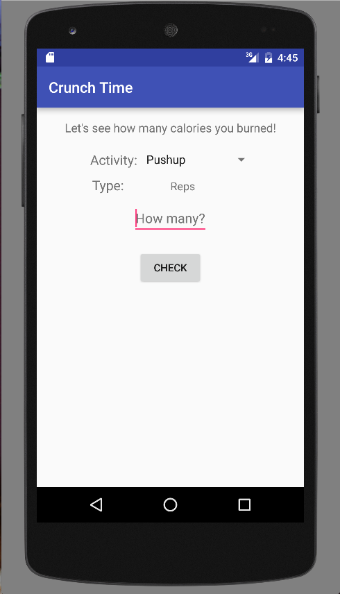
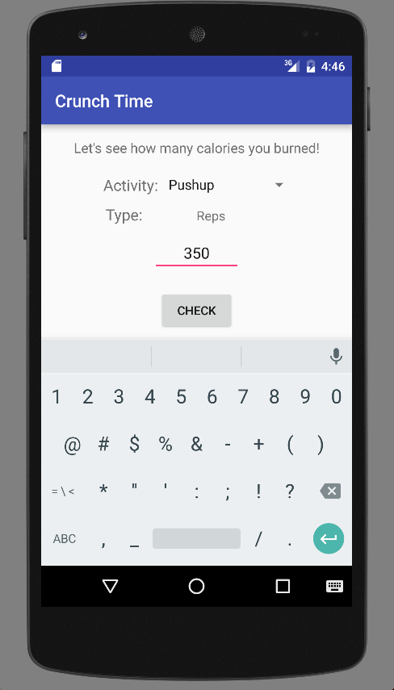
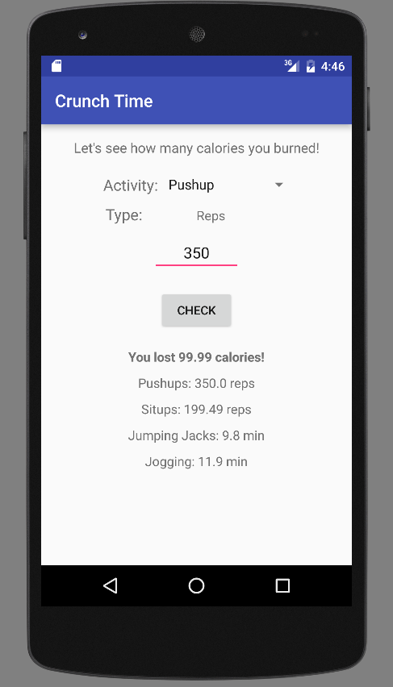

# PROG 01: Crunch Time

Crunch Time is a fun app that allows you to figure out how many calories you've burned after performing a certain number of reps or amount of time for a workout.

## Authors

Rachel Lin ([rachellin@berkeley.edu](mailto:rachellin@berkeley.edu))

## Demo Video

See [Crunch Time] (https://https://youtu.be/EX8CI4-V-lI)

## Executable
app-debug.apk can be found in the Application folder.

## Screenshots

## Acknowledgments

* Hat tip to anyone who's code was used
* Any other support

*Feel free to enhance your README. For Markdown syntax, see [the GitHub Guides](https://guides.github.com/features/mastering-markdown/). Remove this line in your submission.*
